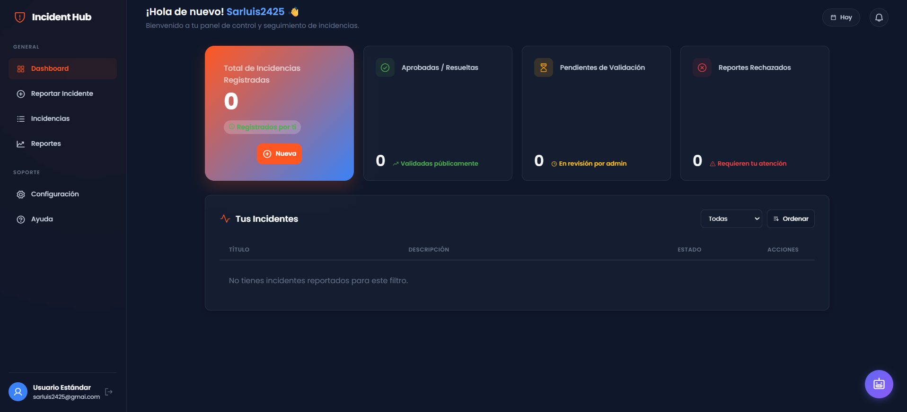
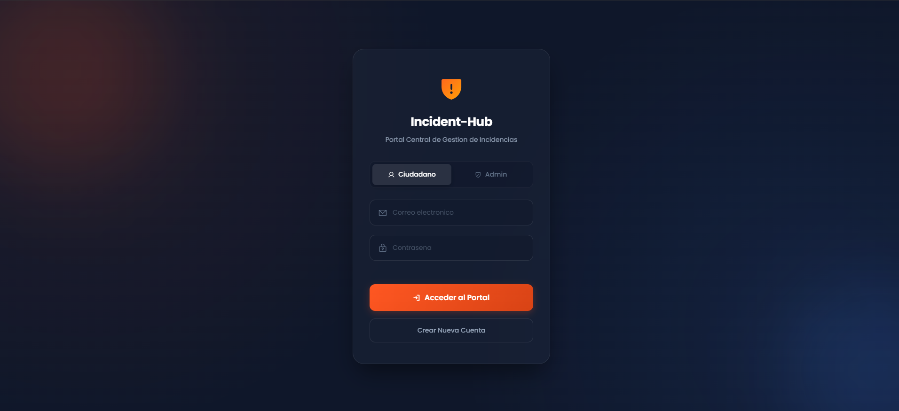
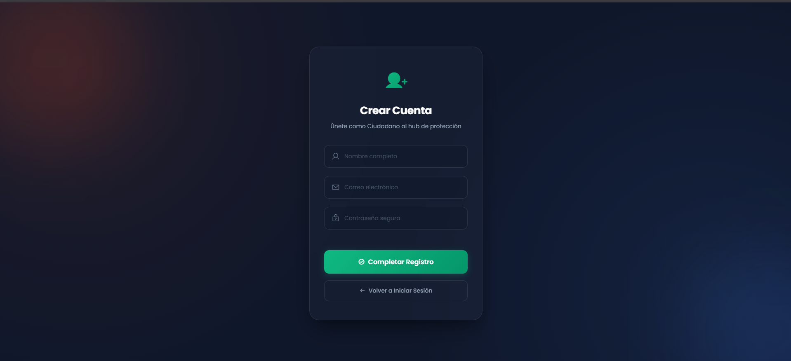
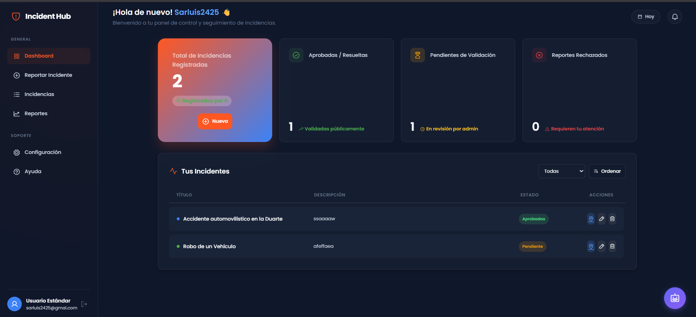
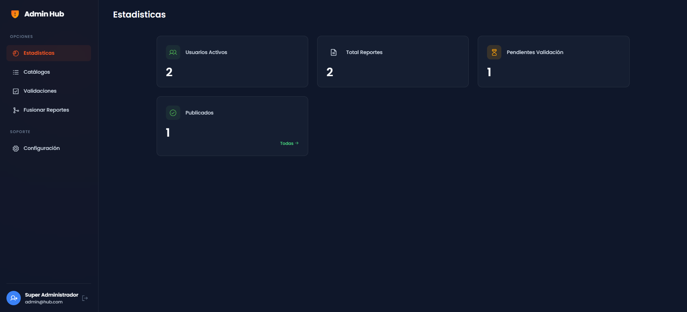
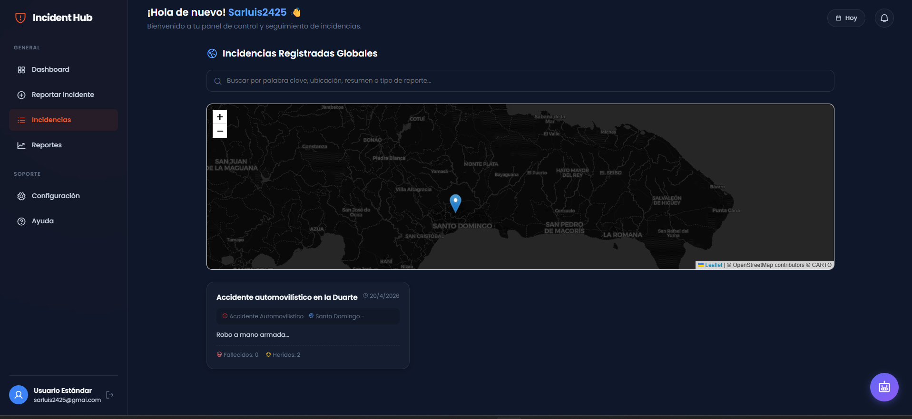
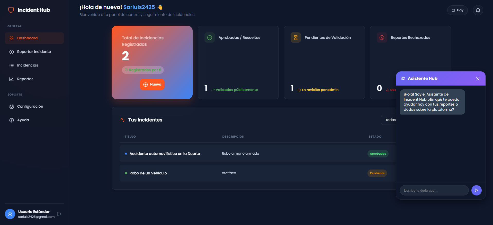
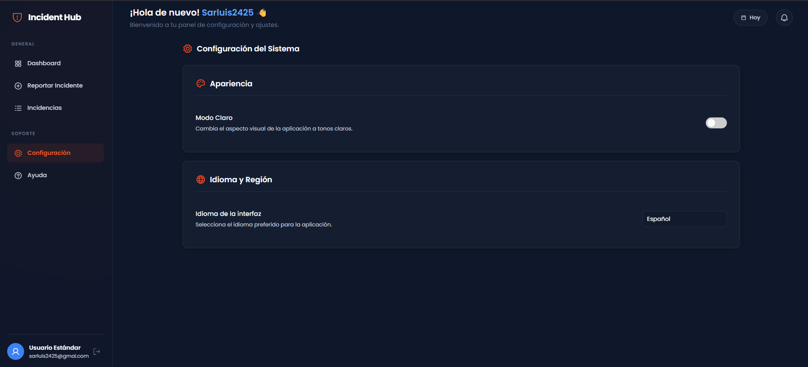

<div align="center">

# 🚨 Incident-Hub

**Plataforma inteligente y moderna de gestión de incidencias urbanas y accidentes**
*Optimizado para la República Dominicana 🇩🇴*


<br/>
<br/>



</div>

---

## 📑 Tabla de Contenidos

- [📖 Descripción](#-descripción)
- [✨ Características Principales](#-características-principales)
- [🛠️ Stack Tecnológico](#️-stack-tecnológico)
- [📸 Preview](#-preview)
- [🚀 Instalación y Configuración](#-instalación-y-configuración)
  - [Requisitos Previos](#1-requisitos-previos)
  - [Pasos de Instalación](#2-pasos-de-instalación)
  - [Ejecutar el Proyecto](#4-lanzar-la-ejecución)
- [📁 Estructura del Proyecto](#-estructura-del-proyecto)
- [🔌 API Endpoints](#-api-endpoints)
- [👨‍💻 Equipo y Roles](#-equipo-y-roles)

---

## 📖 Descripción

**Incident-Hub** es una solución de software integral enfocada en el reporte colaborativo, seguimiento y validación ciudadana de emergencias, accidentes de tráfico, cráteres urbanos, irregularidades y otros incidentes. El sistema fusiona bases de datos robustas (MongoDB) con un panel interactivo altamente intuitivo.

Los usuarios pueden **ubicar incidentes directamente en el mapa local**, conversar con un asistente virtual inteligente (Gemini AI) y obtener métricas validadas por administradores, garantizando una fuente confiable y rápida de advertencias para toda la comunidad.

---

## ✨ Características Principales

### 🤖 Asistente Inteligente (Gemini AI)
Chatea con la inteligencia artificial directamente desde un **widget flotante** para resolver dudas comunes, conocer procesos clave y pedir orientación general sobre el reporte de incidencias. Funciona con el modelo `gemini-2.5-flash` de Google.

### 🗺️ Mapeo Integrado (Leaflet)
Los reportes se adjuntan a coordenadas exactas (Lat/Lon) con un marcador visual durante el registro, permitiendo la previsualización global de todos los casos abiertos en un mapa interactivo.

### 🌓 Temas Nativos (Dark / Light Mode)
El panel completo y el chat soportan cambio dinámico de tema sin interrumpir tu trabajo, con un diseño *Glassmorphism* estético y accesible.

### 🌐 Soporte Bilingüe (i18n)
Traducción completa y dinámica al **Español** e **Inglés** de toda la aplicación utilizando selectores nativos.

### 👑 Centro de Administración Avanzado
Dashboard con estadísticas en tiempo real, validación (aprobación/rechazo) de incidentes, y gestión completa de catálogos maestros (Provincias, Municipios, Barrios y Tipos de Caso).

### 🔐 Sistema de Autenticación
Registro e inicio de sesión de usuarios con roles diferenciados (usuario estándar y administrador).

---

## 🛠️ Stack Tecnológico

### Backend
| Tecnología | Descripción |
|---|---|
| **Node.js** | Entorno de ejecución del servidor |
| **Express.js** | Framework REST API |
| **MongoDB** | Base de datos NoSQL |
| **Mongoose** | ODM para modelado de datos |
| **@google/generative-ai** | SDK para integración con Gemini AI |
| **dotenv** | Gestión de variables de entorno |

### Frontend
| Tecnología | Descripción |
|---|---|
| **HTML5** | Estructura de la aplicación |
| **CSS3** | Estilos con variables, Glassmorphism y animaciones |
| **JavaScript (Vanilla)** | Lógica y ruteo SPA simulado con manipulación del DOM |
| **Leaflet** | Librería para mapas interactivos |
| **Phosphor Icons** | Iconografía global |

---

## 📸 Preview

<div align="center">

### 🔐 Inicio de Sesión


### 📝 Registro


### 📊 Dashboard del Usuario


### 👑 Dashboard del Administrador


### 🗺️ Mapa de Incidentes


### 🤖 Chat con IA


### ⚙️ Configuración


</div>

---

## 🚀 Instalación y Configuración

Sigue estos pasos para correr el proyecto en tu entorno local.

### 1. Requisitos Previos
- **Node.js** v18 o superior
- Gestor de paquetes **npm**
- **MongoDB** instalado localmente y corriendo en el puerto por defecto (`27017`)

### 2. Pasos de Instalación

```bash
# Clona el repositorio
git clone https://github.com/tu-usuario/Incident-Hub.git
cd Incident-Hub

# Entra a la carpeta del servidor
cd backend

# Instala las dependencias
npm install
```


### 3. Lanzar la Ejecución

Asegúrate de que MongoDB esté corriendo y luego:

```bash
npm start
```

El servidor se iniciará en el puerto **3000**. Accede a la aplicación en: [http://localhost:3000](http://localhost:3000)

---

## 📁 Estructura del Proyecto

```text
📦 Incident-Hub
 ┣ 📂 backend
 ┃ ┣ 📂 controllers        # Lógica central (auth, incidents, admin, AI)
 ┃ ┣ 📂 models             # Esquemas de Mongoose
 ┃ ┣ 📂 routes             # Definiciones de endpoints REST
 ┃ ┣ 📂 src                # Módulos auxiliares
 ┃ ┣ 📜 server.js          # Punto de entrada (Express App)
 ┃ ┗ 📜 package.json
 ┣ 📂 frontend
 ┃ ┗ 📂 public
 ┃   ┣ 📂 assets           # CSS (style.css, ai-chat.css)
 ┃   ┣ 📂 js               # Scripts (dashboard, admin, i18n, AI chat, etc.)
 ┃   ┣ 📜 login.html       # Página de inicio de sesión
 ┃   ┣ 📜 register.html    # Página de registro
 ┃   ┣ 📜 dashboard.html   # Panel principal del usuario
 ┃   ┣ 📜 admin_dashboard.html  # Panel del administrador
 ┃   ┣ 📜 configuracion.html    # Ajustes (tema e idioma)
 ┃   ┣ � incidents.html   # Vista de incidentes
 ┃   ┗ 📜 map.html         # Vista del mapa
 ┗ 📂 docs
   ┗ 📂 screenshots        # Capturas de pantalla de la aplicación
```

---

## 🔌 API Endpoints

Todos los endpoints utilizan el prefijo base `http://localhost:3000`.

### 🔐 Autenticación (`/api/auth`)

| Método | Endpoint | Descripción |
|--------|----------|-------------|
| `POST` | `/api/auth/register` | Registrar un nuevo usuario |
| `POST` | `/api/auth/login` | Iniciar sesión |
| `GET` | `/api/auth/users` | Obtener lista de usuarios |

### 📋 Incidentes (`/api/incidents`)

| Método | Endpoint | Descripción |
|--------|----------|-------------|
| `POST` | `/api/incidents` | Crear un incidente |
| `GET` | `/api/incidents` | Obtener todos los incidentes |
| `GET` | `/api/incidents/:id` | Obtener incidente por ID |
| `PUT` | `/api/incidents/:id` | Actualizar un incidente |
| `DELETE` | `/api/incidents/:id` | Eliminar un incidente |
| `POST` | `/api/incidents/:id/comments` | Agregar comentario a un incidente |

### 👑 Administración (`/api/admin`)

| Método | Endpoint | Descripción |
|--------|----------|-------------|
| `GET` | `/api/admin/stats` | Obtener estadísticas generales |
| `GET` | `/api/admin/incidents/pending` | Incidentes pendientes de validación |
| `PUT` | `/api/admin/incidents/:id/publish` | Aprobar/publicar un incidente |
| `PUT` | `/api/admin/incidents/:id/reject` | Rechazar un incidente |
| `POST` | `/api/admin/incidents/merge` | Fusionar incidentes duplicados |
| `CRUD` | `/api/admin/provinces` | Gestión de catálogo de Provincias |
| `CRUD` | `/api/admin/municipalities` | Gestión de catálogo de Municipios |
| `CRUD` | `/api/admin/neighborhoods` | Gestión de catálogo de Barrios |
| `CRUD` | `/api/admin/incident-types` | Gestión de catálogo de Tipos de Caso |

### 🤖 Inteligencia Artificial (`/api/ai`)

| Método | Endpoint | Descripción |
|--------|----------|-------------|
| `POST` | `/api/ai/chat` | Enviar mensaje al asistente virtual |

---

## 👨‍💻 Equipo y Roles


**Angery Joely Payamps** - Líder Técnico & Desarrollador Backend
[](https://github.com/angerypr)

**Luis Armando Martínez** - Desarrollador Frontend & UX/UI
[](https://github.com/LuisArDev241)

**Karen Margarita Antigua** - Analista de Datos & Visualización
[](https://github.com/KAntigua)

**Wilmar Sánchez Suárez** - Especialista en Inteligencia Artificial
[](https://github.com/wilmar0312)


---


> *"Convertimos el caos en información valiosa, clara y estructurada para todos."*